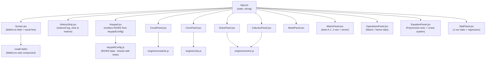
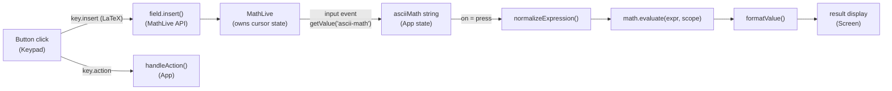
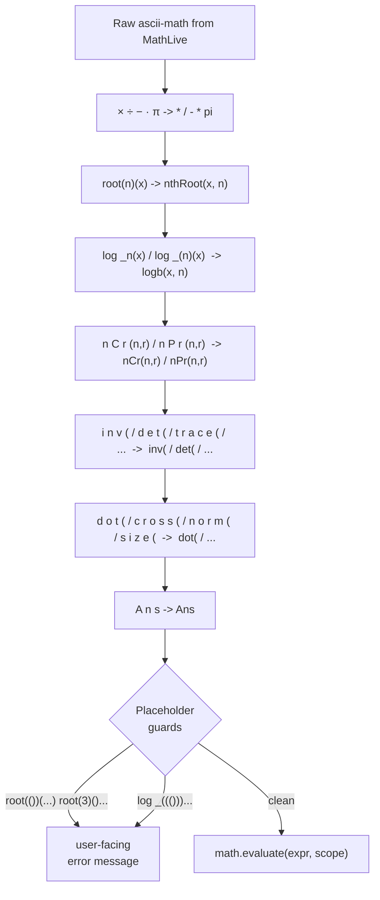

# Architecture

## Stack

| Layer | Library | Role |
|-------|---------|------|
| UI | React 18 + Vite | Component rendering, state |
| Math input | MathLive | Textbook-style editable math field |
| Evaluation | math.js | Expression parser and evaluator |
| Tests | Vitest | Unit tests, node environment |

---

## Component tree



The overlay panels (ConstPanel, ConvPanel, SolvePanel, CalculusPanel, ModePanel, MatrixPanel, OperationsPanel, EquationPanel, StatPanel) are rendered inside `.device` and cover the full calculator body with `position: absolute; inset: 0`. Only one is open at a time via `panel` state in App.

---

## Keypress to result: data flow



The MathLive field is uncontrolled - React never pushes a value back into it, so the cursor stays where it is. The keypad writes via `field.insert()` and `field.executeCommand('deleteBackward')`, exposed through a ref. History restore calls `field.setValue(latex)` and then manually syncs `asciiMath` state by calling `onChange` with the new values, since `setValue` does not fire `input` events.

---

## MathLive ascii-math bridge

MathLive's `getValue('ascii-math')` is the bridge into math.js. The output is close to math.js syntax but has several non-standard forms that `normalizeExpression` patches:



The spaced-letter normalizations (steps S5 and S6) are needed because MathLive serializes `\operatorname{inv}` as `i n v` in ascii-math. The keypad inserts these functions via the MathLive API as `\operatorname{fn}(` to avoid MathLive intercepting sequential letter keypresses as LaTeX commands (e.g. typing `i`, `n` produces `\in` which is the set membership symbol).

The guards catch expressions where the user left a MathLive placeholder (`#0`) unfilled. These serialize to `()` in ascii-math and would produce a cryptic math.js parse error.

---

## Evaluation scope

`buildScope(angleMode, vars)` passes a plain object to `math.evaluate`.

**Built-in overrides:**

```
sin / cos / tan / sec / csc / cot   - angle-mode-aware (deg <-> rad conversion)
asin / acos / atan                   - angle-mode-aware inverse
arcsin / arccos / arctan             - aliases for \arcsin LaTeX form
asec / acsc / acot                   - inverse reciprocal trig
log                                  - overridden to log10 (calculator convention)
ln                                   - natural log (math.js has no built-in ln)
logb(x, b)                           - arbitrary base log
nCr(n, r)                            - wraps math.combinations
nPr(n, r)                            - wraps math.permutations
Ans                                  - last result, injected from App state
```

**Matrix/vector variables (A-J):**

Stored as plain 2D JS arrays in React state and injected into scope by `buildScope`. Shape determines how they are passed to math.js:

- 2+ rows, any columns: wrapped with `math.matrix()` - a DenseMatrix for `inv`, `det`, `trace`, `transpose`
- 1 row (1xN): flattened to a 1D JS array - a vector for `dot`, `norm`, `cross`
- N rows, 1 column (Nx1): also flattened to a 1D JS array

This means a slot set to 1x3 in the matrix panel becomes a 3-element vector in scope, while a 2x2 or 3x3 slot becomes a DenseMatrix.

---

## Complex number output

`evaluateExpression` checks `math.typeOf(value)`:

- `'Complex'` - result is a complex number; `formatValue` renders it as `a + bi` (rect) or `r∠θ` (polar)
- `'DenseMatrix'` or `'SparseMatrix'` - result is a matrix; rows formatted as `[a  b]\n[c  d]`
- anything else - number, formatted with `math.format(n, { precision: 10 })`

`isComplex` and `isMatrix` flags are returned alongside the display string so the UI can show the RECT/POLAR toggle or apply the `.is-matrix` CSS class.

---

## Layout and sizing

All sizing uses `dvh` (dynamic viewport height) and `vw` (viewport width) - no pixel values and no `@media` breakpoints. `dvh` differs from `vh` in that it accounts for mobile browser chrome collapsing.

The layout chain: `.wrap` is a flex column at `50vw` wide and `96dvh` tall. `.device` takes the remaining vertical space via `flex: 1`. `.keys` is also `flex: 1` with a flex-column of `.krow` rows, each `flex: 1`, so button rows divide the available height equally. The bottom mod row has 5 columns (CONST, CONV, SOLVE, BASE-N, OPS); all other rows have 5 or 4 columns per the grid rules in keypadConfig.

`.screen` has a fixed `26dvh` height so the screen area never shifts when math content changes size.

---

## Typography

The UI uses **JetBrains Mono** (Google Fonts) throughout: keypad labels, result line, status bar, and overlay panels.

The math input field is an exception. MathLive renders its content using its own KaTeX-style math fonts loaded internally. These cannot be overridden via CSS without breaking the math rendering (fractions, roots, and superscripts rely on specific glyph metrics in those fonts). The math field uses fonts suited to mathematical typesetting; everything else uses JetBrains Mono.

---

## Unit conversion

`engine/units.js` stores conversion factors as "how many base units per 1 of this unit". Conversion is `value * fromFactor / toFactor`. Temperature is a special case (affine, not a ratio) handled with explicit C/F/K formulas.

16 categories, ~90 units total.

---

## Numeric engine

`engine/numeric.js` provides:

| Export | Description |
|--------|-------------|
| `compileFn(expr)` | Parses and compiles a math.js expression into a callable `f(x)` |
| `derivativeAt(fn, x)` | Central difference, h = 1e-5 |
| `integrate(fn, a, b)` | Composite Simpson's rule, n = 200 |
| `newtonRaphson(fn, x0)` | Newton-Raphson root finder, max 50 iterations |
| `secant(fn, x0, x1)` | Secant method |
| `bisection(fn, a, b)` | Bisection method |
| `polyRoots(coeffs)` | Closed-form for degree 1-2; companion-matrix eigenvalues for degree 3-10 |
| `solveLinearSystem(A, b)` | Gaussian elimination with partial pivoting; supports 2x2 through 5x5 |

`polyRoots` and `solveLinearSystem` are used by `EquationPanel` for the Equation mode accessible from the MODE menu.

---

## Testing

364 Vitest tests across three files, running in node environment.

```
src/
  components/__tests__/keypad.test.js    - structural integrity + key contract tests
  engine/__tests__/mathEngine.test.js    - normalizeExpression + evaluateExpression + polyRoots + solveLinearSystem
  engine/__tests__/stats.test.js         - oneVarStats + twoVarStats (all four regression models)
```

`keypadConfig.js` is extracted from `Keypad.jsx` so tests can import ROWS without JSX/React transforms.

Test categories in `mathEngine.test.js`:

- normalizeExpression: character subs, nth-root bridge, log-base bridge, nPr/nCr bridge, matrix operatorname bridge (inv/det/trace/transpose/size/dot/cross/norm), Ans bridge
- evaluateExpression: arithmetic, powers/roots, trig (deg + rad), inverse trig, reciprocal trig, logs, combinatorics, Ans, constants, expected failures, full MathLive pipeline per button, complex numbers, matrix variables in scope, OPS matrix operations, OPS vector operations (inline and stored 1-row variables)
- polyRoots: degree 1-6, real and complex roots, repeated roots
- solveLinearSystem: 2x2 through 5x5, singular matrix error
- oneVarStats: n/sum/Σx²/mean/median/mode/quartiles/IQR/range/stddev/variance/sampleStddev/sampleVariance/CV/SEM/skewness/kurtosis/min/max, edge cases
- percentile: linear interpolation, P0/P50/P100 boundaries, single element, empty array
- mode: single mode, bimodal, no mode, empty, sorted output
- twoVarStats: linear/quadratic/exponential/power regression, perfect fits, domain errors
