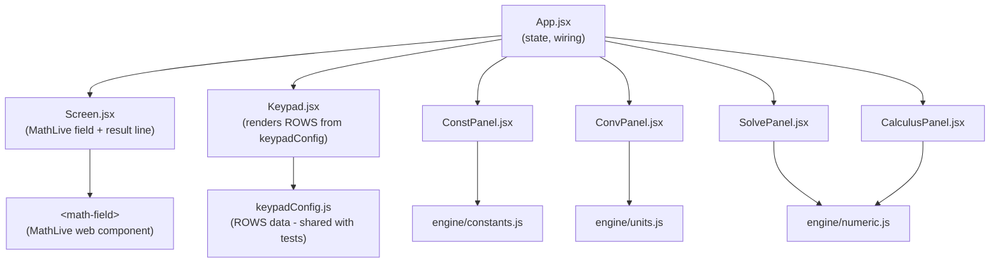
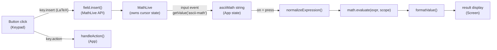
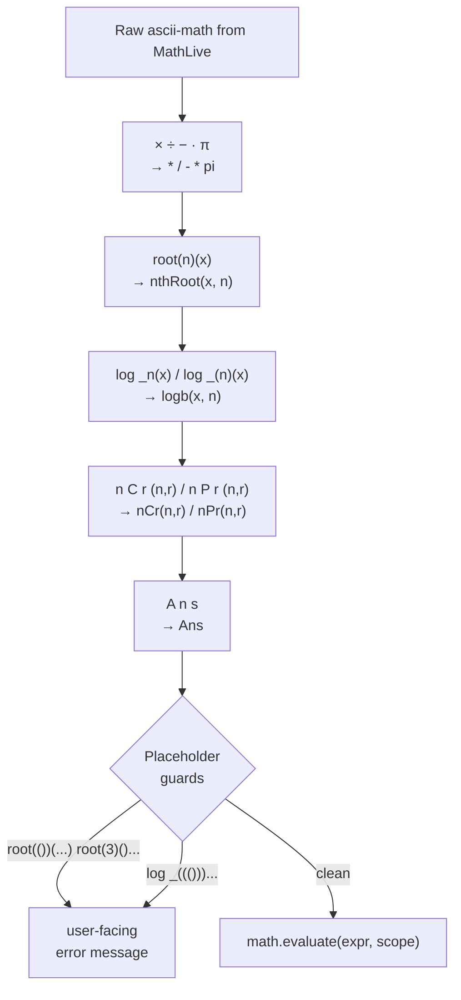

# Architecture - Phase 1

## Stack

| Layer | Library | Role |
|-------|---------|------|
| UI | React 18 + Vite | Component rendering, state |
| Math input | MathLive | Textbook-style editable math field |
| Evaluation | math.js | Expression parser and evaluator |
| Tests | Vitest | Unit tests, node environment |

---

## Component tree



The four panels (`ConstPanel`, `ConvPanel`, `SolvePanel`, `CalculusPanel`) are rendered inside `.device` and positioned with `position: absolute; inset: 0` so they cover the full calculator body. Only one panel is open at a time via `panel` state in App.

---

## Keypress to result: data flow



Key design choice: the MathLive field is **uncontrolled**. React never pushes a value back into it, so the cursor stays where it is. The keypad writes via `field.insert()` and `field.executeCommand('deleteBackward')`, exposed through a ref.

---

## MathLive ascii-math bridge

MathLive's `getValue('ascii-math')` is the bridge into math.js. The output is close to math.js syntax but has several non-standard forms that `normalizeExpression` patches:



The guards catch expressions where the user left a MathLive placeholder (`#0`) unfilled - these serialize to `()` in ascii-math and would produce a cryptic math.js parse error.

---

## Evaluation scope

`buildScope(angleMode, vars)` passes a plain object to `math.evaluate`. Scope keys shadow math.js built-ins:

```
sin / cos / tan / sec / csc / cot   - angle-mode-aware (deg <-> rad conversion)
asin / acos / atan                   - angle-mode-aware inverse
arcsin / arccos / arctan             - aliases for \arcsin LaTeX form
asec / acsc / acot                   - inverse reciprocal trig
log                                  - overridden to log10 (calculator convention)
ln                                   - natural log (math.js has no built-in ln)
logb(x, b)                           - arbitrary base log
nCr(n, r)                            - wraps math.combinations
nPr(n, r)                            - wraps math.permutations
Ans                                  - last result, injected from App state
```

---

## Layout and sizing

All sizing uses `dvh` (dynamic viewport height) and `vw` (viewport width) - no pixel values and no `@media` breakpoints. `dvh` differs from `vh` in that it accounts for mobile browser chrome collapsing.

The layout chain: `.wrap` is a flex column at `50vw` wide and `96dvh` tall. `.device` takes the remaining vertical space via `flex: 1`. `.keys` is also `flex: 1` with a flex-column of `.krow` rows, each `flex: 1`, so button rows divide the available height equally.

`.screen` has a fixed `26dvh` height so that the screen area never shifts when the math content changes size.

---

## Unit conversion

`engine/units.js` stores conversion factors as "how many base units per 1 of this unit". Conversion is `value * fromFactor / toFactor`. Temperature is a special case (affine, not a ratio) handled with explicit C/F/K formulas.

16 categories, ~90 units total.

---

## Numeric engine

`engine/numeric.js` provides:

| Export | Description |
|--------|-------------|
| `compileFn(expr)` | Parses and compiles a math.js expression into a callable `f(x)` |
| `derivativeAt(fn, x)` | Central difference, h = 1e-5 |
| `integrate(fn, a, b)` | Composite Simpson's rule, n = 200 |
| `newtonRaphson(fn, x0)` | Newton-Raphson root finder, max 50 iterations |
| `secant(fn, x0, x1)` | Secant method |
| `bisection(fn, a, b)` | Bisection method |
| `polyRoots(coeffs)` | Closed-form quadratic; companion-matrix eigenvalues for higher degrees |
| `solveLinearSystem(A, b)` | Gaussian elimination with partial pivoting |

`polyRoots` and `solveLinearSystem` are implemented but not yet wired to a UI panel (Phase 3).

---

## Testing

225 Vitest tests across two files, running in node environment.

```
src/
  components/__tests__/keypad.test.js    - structural integrity + key contract tests
  engine/__tests__/mathEngine.test.js    - normalizeExpression + evaluateExpression
```

`keypadConfig.js` is extracted from `Keypad.jsx` specifically so tests can import ROWS without needing JSX/React transforms.

Test categories in `mathEngine.test.js`:
- normalizeExpression: character subs, nth-root bridge, log-base bridge, nPr/nCr bridge, Ans bridge
- evaluateExpression: arithmetic, powers/roots, trig (deg + rad), inverse trig, reciprocal trig, logs, combinatorics, Ans, constants, expected failures, full MathLive pipeline per button
