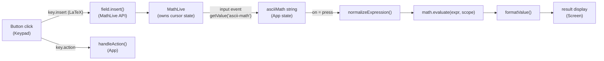
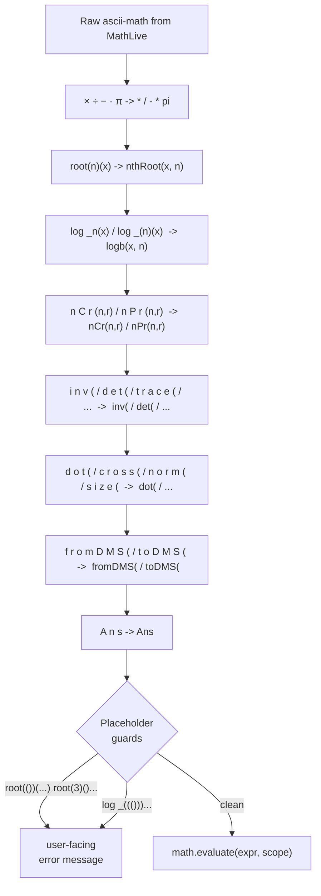

# Architecture

## Stack

| Layer | Library | Role |
|-------|---------|------|
| UI | React 18 + Vite | Component rendering, state |
| Math input | MathLive | Textbook-style editable math field |
| Evaluation | math.js | Expression parser and evaluator |
| Tests | Vitest | Unit tests, node environment |

---

## Component tree

```mermaid
graph TD
    App["App.jsx\n(state, wiring)"]

    App --> Screen["Screen.jsx\n(MathLive field + result line)"]
    App --> HS["HistoryStrip.jsx\n(indexed log, click to restore)"]
    App --> Keypad["Keypad.jsx\n(renders ROWS from keypadConfig)"]
    App --> CP["ConstPanel.jsx"]
    App --> CV["ConvPanel.jsx"]
    App --> SP["SolvePanel.jsx"]
    App --> CA["CalculusPanel.jsx"]
    App --> MP["ModePanel.jsx"]
    App --> MAT["MatrixPanel.jsx\n(slots A-J, 1-row = vector)"]
    App --> OP["OperationsPanel.jsx\n(Convert / Math / Matrix / Vector / Complex tabs)"]
    App --> EQ["EquationPanel.jsx\n(Polynomial roots + Linear system)"]
    App --> ST["StatPanel.jsx\n(1-var stats + regression)"]
    App --> DI["DistributionPanel.jsx\n(Normal + Binomial)"]
    App --> BNP["BaseNPanel.jsx\n(Numbers tab + K-map tab)"]
    App --> TP["TablePanel.jsx\n(f(x) + optional g(x) table)"]

    Screen --> MF["&lt;math-field&gt;\n(MathLive web component)"]

    Keypad --> KC["keypadConfig.js\n(ROWS data - shared with tests)"]

    CP --> C["engine/constants.js"]
    CV --> U["engine/units.js"]
    SP --> N["engine/numeric.js"]
    CA --> N
```



The overlay panels (ConstPanel, ConvPanel, SolvePanel, CalculusPanel, ModePanel, MatrixPanel, OperationsPanel, EquationPanel, StatPanel, DistributionPanel, BaseNPanel) are rendered inside `.device` and cover the full calculator body with `position: absolute; inset: 0`. Only one is open at a time via `panel` state in App.

The BASE button (top modifier row) cycles `baseMode` through `dec -> hex -> oct -> bin -> dec` via the `cycleBase` action, the same pattern as DRG cycling `angleMode`. When `baseMode` is non-decimal the status bar shows the active base and `formatInBase()` in App reformats integer results. `BaseNPanel` is an additional overlay for base-N expression evaluation and K-map minimization.

---

## Keypress to result: data flow



The MathLive field is uncontrolled - React never pushes a value back into it, so the cursor stays where it is. The keypad writes via `field.insert()` and `field.executeCommand('deleteBackward')`, exposed through a ref. History restore calls `field.setValue(latex)` and then manually syncs `asciiMath` state by calling `onChange` with the new values, since `setValue` does not fire `input` events.

---

## MathLive ascii-math bridge

MathLive's `getValue('ascii-math')` is the bridge into math.js. The output is close to math.js syntax but has several non-standard forms that `normalizeExpression` patches:



The spaced-letter normalizations (steps S5 and S6) are needed because MathLive serializes `\operatorname{inv}` as `i n v` in ascii-math. The keypad inserts these functions via the MathLive API as `\operatorname{fn}(` to avoid MathLive intercepting sequential letter keypresses as LaTeX commands (e.g. typing `i`, `n` produces `\in` which is the set membership symbol).

The guards catch expressions where the user left a MathLive placeholder (`#0`) unfilled. These serialize to `()` in ascii-math and would produce a cryptic math.js parse error.

---

## Evaluation scope

`buildScope(angleMode, vars)` passes a plain object to `math.evaluate`.

**Built-in overrides:**

```
sin / cos / tan / sec / csc / cot   - angle-mode-aware (deg <-> rad conversion)
asin / acos / atan                   - angle-mode-aware inverse
arcsin / arccos / arctan             - aliases for \arcsin LaTeX form
asec / acsc / acot                   - inverse reciprocal trig
log                                  - overridden to log10 (calculator convention)
ln                                   - natural log (math.js has no built-in ln)
logb(x, b)                           - arbitrary base log
nCr(n, r)                            - wraps math.combinations
nPr(n, r)                            - wraps math.permutations
Ans                                  - last result, injected from App state
```

**Matrix/vector variables (A-J):**

Stored as plain 2D JS arrays in React state and injected into scope by `buildScope`. Shape determines how they are passed to math.js:

- 2+ rows, any columns: wrapped with `math.matrix()` - a DenseMatrix for `inv`, `det`, `trace`, `transpose`
- 1 row (1xN): flattened to a 1D JS array - a vector for `dot`, `norm`, `cross`
- N rows, 1 column (Nx1): also flattened to a 1D JS array

This means a slot set to 1x3 in the matrix panel becomes a 3-element vector in scope, while a 2x2 or 3x3 slot becomes a DenseMatrix.

**Memory variables (K-T):**

Ten scalar slots stored in React state and injected into the evaluation scope alongside matrix variables. Namespaced K-T to avoid collision with matrix variables A-J and hex digits A-F. Non-null slots are substituted as plain numeric values. STO mode (SHIFT+AC then digit 1-9/0) writes the current result; RCL mode (ALPHA+AC then digit) inserts the slot letter into the expression for evaluation.

---

## Complex number output

`evaluateExpression` checks `math.typeOf(value)`:

- `'Complex'` - result is a complex number; `formatValue` renders it as `a + bi` (rect) or `r∠θ` (polar)
- `'DenseMatrix'` or `'SparseMatrix'` - result is a matrix; rows formatted as `[a  b]\n[c  d]`
- anything else - number, formatted with `math.format(n, { precision: 10 })`

`isComplex` and `isMatrix` flags are returned alongside the display string so the UI can show the RECT/POLAR toggle or apply the `.is-matrix` CSS class.

**DMS display:** `toDMS(decimalDeg)` in `mathEngine.js` formats a decimal-degrees value as `D°M'S"`. App state tracks `dmsMode` and `lastNumericValue`; toggling DMS reformats the result display without re-evaluating. The DMS toggle button appears only when the last result is a real (non-complex, non-matrix) number.

**Math/Line display toggle:** `displayMode` state (`'math'` or `'line'`) is passed to Screen; toggling calls `field.defaultMode = 'text'` or `'math'` on the MathLive element via the imperative ref. The MATH/LINE button is always visible in the display row.

---

## Layout and sizing

All sizing uses `dvh` (dynamic viewport height) and `vw` (viewport width) - no pixel values and no `@media` breakpoints. `dvh` differs from `vh` in that it accounts for mobile browser chrome collapsing.

The layout chain: `.wrap` is a flex column at `50vw` wide and `96dvh` tall. `.device` takes the remaining vertical space via `flex: 1`. `.keys` is also `flex: 1` with a flex-column of `.krow` rows, each `flex: 1`, so button rows divide the available height equally. The bottom mod row has 5 columns (CONST, CONV, SOLVE, BASE-N, OPS); all other rows have 5 or 4 columns per the grid rules in keypadConfig.

`.screen` has a fixed `26dvh` height so the screen area never shifts when math content changes size.

---

## Typography

The UI uses **JetBrains Mono** (Google Fonts) throughout: keypad labels, result line, status bar, and overlay panels.

The math input field is an exception. MathLive renders its content using its own KaTeX-style math fonts loaded internally. These cannot be overridden via CSS without breaking the math rendering (fractions, roots, and superscripts rely on specific glyph metrics in those fonts). The math field uses fonts suited to mathematical typesetting; everything else uses JetBrains Mono.

---

## Unit conversion

`engine/units.js` stores conversion factors as "how many base units per 1 of this unit". Conversion is `value * fromFactor / toFactor`. Temperature is a special case (affine, not a ratio) handled with explicit C/F/K formulas.

16 categories, ~90 units total.

---

## Numeric engine

`engine/numeric.js` provides:

| Export | Description |
|--------|-------------|
| `compileFn(expr, varName, angleMode)` | Parses and compiles a math.js expression into a callable `f(x)`; varName defaults to `'x'`, angleMode to `'rad'` |
| `compileImplicitFn(expr, angleMode)` | Compiles an implicit equation `LHS = RHS` into `F(x,y) = LHS − RHS`; uses a mutable shared scope for performance across the 300×300 marching-squares grid |
| `derivativeAt(fn, x)` | Central difference, h = 1e-5 |
| `integrate(fn, a, b)` | Composite Simpson's rule, n = 200 |
| `newtonRaphson(fn, x0)` | Newton-Raphson root finder, max 50 iterations |
| `secant(fn, x0, x1)` | Secant method |
| `bisection(fn, a, b)` | Bisection method |
| `polyRoots(coeffs)` | Closed-form for degree 1-2; companion-matrix eigenvalues for degree 3-10 |
| `solveLinearSystem(A, b)` | Gaussian elimination with partial pivoting; supports 2x2 through 5x5 |

`polyRoots` and `solveLinearSystem` are used by `EquationPanel` for the Equation mode accessible from the MODE menu.

`compileFn` is also used by `GraphPanel` (GRAPH key) and `TablePanel` (MODE -> 5) to evaluate user expressions at many x values. Both pass the active `angleMode` so trig functions respect DEG/RAD.

---

## Graph panel

`GraphPanel` renders a DPR-aware `<canvas>` inside a flex-column overlay. Layout: header + function input rows + window fields, then the canvas wrapper (`flex: 1`) holds a base canvas (the graph) and an overlay canvas (the crosshair), both stacked via `position: absolute`.

**Explicit curves** (`parseExpr` returns `implicit: false`): sampled at 2 points per pixel across the x range; large vertical pixel jumps lift the pen to handle discontinuities like `tan(x)` and `1/x`.

**Implicit curves** (`parseExpr` returns `implicit: true`): plotted by `drawImplicitCurve` using marching squares on a 300×300 grid. Each cell checks its four corners for sign changes in F(x,y) and linearly interpolates crossing points. The saddle case (4 crossings) connects opposite pairs.

**Crosshair**: drawn on the overlay canvas by `drawCrosshair`. On every `mousemove`, the x coordinate is converted to math space and stored as `crosshairX` state. For explicit curves, y = fn(mathX) is computed directly. For implicit curves, `findImplicitYs` sweeps 300 y samples looking for sign changes and linearly interpolates each zero. Each intersection gets a dot, a dashed horizontal line, and a `(x, y)` label. Click toggles the lock state; when locked the line turns amber and hover events are ignored.

**1:1 button**: reads the base canvas `clientWidth` / `clientHeight` and adjusts `winStr.ymin` / `winStr.ymax` so that `(xmax−xmin)/W = (ymax−ymin)/H`, keeping the y-center fixed. The reactive `useEffect([plot])` then replots automatically.

Coordinate transforms (`toPixelX`, `toPixelY`) are exported pure functions, tested directly in the test suite without any canvas mock.

---

## Base-N engine

`engine/baseN.js` provides:

| Export | Description |
|--------|-------------|
| `parseBase(str, base)` | Parse a string in the given base to a BigInt, or null if invalid |
| `evaluateBaseExpr(expr, base)` | Evaluate an expression string in the given base; returns `{ ok, value }` (BigInt) |
| `formatAllBases(n)` | Format a BigInt as `{ bin, oct, dec, hex }` strings |
| `formatBin(n)` | Legacy 32-bit nibble-grouped binary string |
| `bitwiseOp(op, a, b)` | Legacy 32-bit AND/OR/XOR/NOT/LSH/RSH |
| `kmapDims(vars)` | Grid dimensions for 2-6-variable K-map; null for 7-8 (flat list) |
| `kmapHeaders(vars)` | Row/col labels and Gray-code header values |
| `kmapMinterm(vars, row, col)` | Minterm index at a grid position using Gray code (2-6 vars) |
| `findPrimeImplicants(numVars, minterms, dontCares)` | Quine-McCluskey prime implicant list |
| `findMinimalCover(numVars, minterms, primes)` | Essential primes + greedy cover |
| `formatImplicant(prime, numVars)` | SOP term string, e.g. `"AB'"` |
| `karnaughMinimize(vars, cells)` | Full minimization: cells array (0/1/2) -> minimal SOP string |
| `validateBaseDigits(expr, baseMode)` | Returns an error string if the expression contains digits invalid for the active base (e.g. `'5'` in BIN), or null if valid |

`evaluateBaseExpr` supports: `+`, `-`, `*`, `/`, `%`, `AND`/`OR`/`XOR`/`NOT` (keywords or `&`/`|`/`^`/`~`), `<<`, `>>`, parentheses, unary minus. Numbers are BigInt so there is no word-size limit. `NOT` uses a 64-bit mask.

Mixed-base prefix notation is supported within any expression regardless of the active base: `0b` (binary), `0x` or `0h` (hex), `0o` (octal), `0d` (decimal). For example, `A + 0b10` in a HEX-base context evaluates hex A (10) plus binary 2 = 12.

Cells encode: 0 = minterm 0, 1 = minterm 1, 2 = don't care. `karnaughMinimize` returns `'0'` for no minterms and `'1'` when all cells are covered.

For 2-6 variables the K-map tab uses `kmapDims`/`kmapHeaders`/`kmapMinterm` to render a visual Gray-code grid. For 7-8 variables there is no visual grid; the panel shows a flat scrollable minterm list of 128 or 256 cells.

The Numbers tab passes `baseMode` from App state (via `onSetBase` callback) so choosing a base inside the panel also changes the global mode. App.jsx's `formatInBase` converts integer results to the selected base for the main result line. The status bar shows HEX/OCT/BIN when non-decimal.

---

## Testing

636 Vitest tests across five files, running in node environment.

```
src/
  components/__tests__/keypad.test.js       - structural integrity + key contract tests
  engine/__tests__/mathEngine.test.js       - normalizeExpression + evaluateExpression + polyRoots + solveLinearSystem
  engine/__tests__/stats.test.js            - oneVarStats + twoVarStats (all four regression models) + multiVarStats
  engine/__tests__/distributions.test.js    - normalPdf + normalCdf + normalInv + binomialPdf + binomialCdf
  engine/__tests__/baseN.test.js            - parseBase + format functions + bitwiseOp + kmapMinterm + karnaughMinimize + formatImplicant
  (mathEngine.test.js also covers compileImplicitFn: circle/ellipse/hyperbola on-curve/inside/outside, mutable scope isolation, angle-mode trig)
```

`keypadConfig.js` is extracted from `Keypad.jsx` so tests can import ROWS without JSX/React transforms.

Test categories in `mathEngine.test.js`:

- normalizeExpression: character subs, nth-root bridge, log-base bridge, nPr/nCr bridge, matrix operatorname bridge (inv/det/trace/transpose/size/dot/cross/norm), complex operatorname bridge (polar/abs/arg/conj/re/im), math operatorname bridge (mod/floor/ceil/round/sign), DMS bridges (fromDMS/toDMS), % percentage, Ans bridge
- evaluateExpression: arithmetic, powers/roots, trig (deg + rad), inverse trig, reciprocal trig, logs, combinatorics, Ans, constants, expected failures, full MathLive pipeline per button, complex numbers, matrix variables in scope, OPS matrix operations, OPS vector operations (inline and stored 1-row variables), OPS Math tab functions (abs/mod/floor/ceil/round/sign/%), OPS Convert tab (fromDMS, toDMS)
- toDMS: decimal degrees to D degrees M' S" formatting, negative values, float-carry edge cases (e.g. 90.85 -> 90 deg 51' 0"), string passthrough in formatValue
- keypad contracts: structural integrity, key contracts per function group including ALPHA+x = %
- polyRoots: degree 1-6, real and complex roots, repeated roots
- solveLinearSystem: 2x2 through 5x5, singular matrix error
- oneVarStats: n/sum/Σx²/mean/median/mode/quartiles/IQR/range/stddev/variance/sampleStddev/sampleVariance/CV/SEM/skewness/kurtosis/min/max, edge cases
- percentile: linear interpolation, P0/P50/P100 boundaries, single element, empty array
- mode: single mode, bimodal, no mode, empty, sorted output
- twoVarStats: linear/quadratic/exponential/power regression, perfect fits, domain errors
- multiVarStats: k=2 and k=3 perfect fits, coefficient recovery, R², collinearity error, insufficient data error
- normalPdf/normalCdf/normalInv: standard normal values, symmetry, monotonicity, roundtrip, edge cases
- binomialPdf/binomialCdf: known probabilities, sum-to-one, large n, edge cases (p=0/1, k out of range)
- parseBase: decimal/binary/hex BigInt parsing, invalid input rejection
- formatAllBases: all four base representations, large number (2^63)
- format functions: formatBin (nibble grouping), formatOct, formatDec, formatHex (legacy 32-bit)
- bitwiseOp: AND/OR/XOR/NOT, left and logical right shift, unsigned 32-bit semantics (legacy)
- evaluateBaseExpr: arithmetic (+/-/*//%)), bitwise (AND/OR/XOR/NOT/&/|/^/~/<</>>) in hex/binary/decimal, large numbers, error cases (invalid digit, division by zero), mixed-base prefixes (0b/0x/0o/0h/0d)
- validateBaseDigits: BIN rejects 2-9, OCT rejects 8-9, DEC/HEX always null; reports base name and offending digit in error string
- keypad contracts: SHIFT+AC = activateSto, ALPHA+AC = activateRcl
- normalizeExpression - hyperbolic inverse bridge: a s i n h/a c o s h/a t a n h -> asinh/acosh/atanh
- evaluateExpression - hyperbolic functions: sinh/cosh/tanh at 0 and 1, roundtrip inverses asinh/acosh/atanh
- kmapMinterm: 2-var, 3-var, 5-var, 6-var Gray code ordering
- kmapDims: 2-6 vars return grid dims; 7-8 return null (flat list)
- karnaughMinimize: 2-var, 3-var, 5-var cases, all-zeros, all-ones, don't cares
- formatImplicant: complemented and uncomplemented terms, all-masked = '1'
