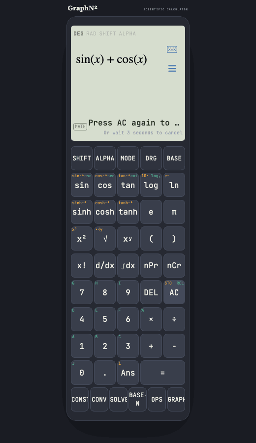
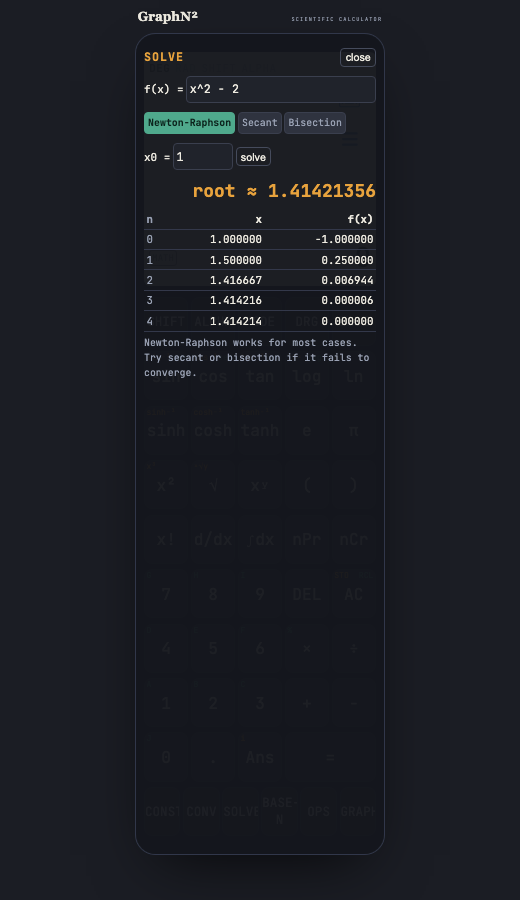

# I Rebuilt the Calculator That Got Me Through Engineering School

**Sum It Up** — GraphN² is a full-featured graphing scientific calculator in
the browser, and this article is less about the feature list and more
about what it takes to own a system like this end to end. An expression
parser and evaluator serve nine different modes off one shared engine,
built before I knew what all nine modes would even be. None of it is
capped at what a physical calculator's memory or display would allow:
equation and polynomial degree, matrix and vector dimensions, regression
predictors, eight-variable Karnaugh maps, simultaneous graphs, all sized
for software instead of a fixed ROM chip. A from-scratch marching cubes
implementation renders 3D implicit surfaces in WebGL. It shipped with the
production discipline most side projects skip: 700-plus tests, real bugs
found and fixed after launch with the actual PR history to prove it, and
three-axis observability covering usage, errors, and performance. Built in
three days, six to ten hours each, working with Claude on implementation
while I owned architecture, scope, and every trade-off. Live at
graph.nsquaredcreative.ca, code is public, try it before reading the rest
if you'd rather see it than read about it.

---

## 1. Why I Built This

Every exam I wrote in engineering school, one object sat next to my pencil:
a Casio fx-991ES. Every problem set, every late night before a deadline, it
was there. I knew it well enough to use shortcuts most people never
touched: SOLVE for equations I didn't want to rearrange by hand, the stats
mode for regression without opening a spreadsheet, base-N conversion for
the one digital logic course that needed it.

Later, in my bachelor's, the tools got bigger. Graphmatica for quick 2D
plots. Wolfram when I needed to see a function's shape before I trusted my
own derivative. MATLAB carried the heavy lifting, Fourier transforms, full
circuit simulations, anything that genuinely needed real code, and it did
that better than anything else I've used since. But for a five-second
sanity check on a simple equation, opening a laptop and writing a script
was more than the moment called for. I wanted that same depth available
without needing to sit down for it.

Years later, I wanted that whole toolkit back, not as nostalgia, but as
something I could actually use and eventually hand to my own kid. Something
that turns "what does this function look like" into an answer in seconds,
because that kind of fast feedback loop is what builds spatial intuition in
the first place. So I built GraphN². What I didn't expect was how much of
actual engineering that turned out to involve.

If you had a tool like this in school, or you're a developer who's ever
thought "I could build something I actually needed instead of another to-do
app," this is what that looks like end to end: the reasoning behind it, the
architecture, and the specific problems that made it hard. If nothing else,
I'd like this to be a nudge to go build the tool you wished existed when you
were learning. It's a better portfolio project than most, because nobody can
fake having actually used the thing they're rebuilding.

---

## 2. What GraphN² Actually Is

Picture the outpost you find at a trailhead halfway up a mountain pass, the
kind with one small room that somehow stocks a spare bike tube, a folding
tripod, a kayak patch kit, and a phone charger. Nobody stops there because
any single item is the best in its category. They stop because they
didn't realize they needed four different specialty shops until this one
place, at exactly the right bend in the road, saved them the trip back
down. That's the shape I wanted for GraphN², the one tab you open when you
don't want to remember which of five tools has the feature you need today.
It won't replace MATLAB for research-grade work. But it's not a toy
either, it's a real expression parser, real numeric methods, and real
WebGL rendering, unified into one place instead of scattered across five
tools.

So, concretely, what's actually in the store:

- **Calc mode**, textbook math input via MathLive, evaluated live, angle
  mode aware, with full complex number support
- **2D graphing**, explicit and implicit curves, with pan, zoom, and trace
- **3D graphing**, explicit surfaces and implicit surfaces via marching
  cubes, rendered in WebGL
- **Matrices and vectors**, determinant, inverse, transpose, dot and cross
  product
- **Statistics**, single and paired-variable stats, linear/quadratic/log/
  exponential/power regression
- **Distributions**, normal and binomial, pdf, cdf, and inverse
- **Equation mode**, poly-solv for closed-form roots, sys-solv for linear
  systems
- **Calculus**, numeric derivative and definite integral on any typed
  expression
- **Unit conversion**, sixteen categories, ninety-plus units
- **A scientific constants library**, CODATA-style, five categories
- **Base-N arithmetic**, binary through hex
- **Karnaugh map minimization**
- **Table mode**, for any expression, not just stored graph functions

It's live at graph.nsquaredcreative.ca, and installable as a PWA, so it
behaves like an app on your phone or desktop instead of just another
browser tab you'll lose track of.

Worth calling out directly: three of the items on that list, the 3D
graphing, the Karnaugh map minimization, and the PWA installability, didn't
start as core scope. They were stretch goals from the very first planning
conversation, the kind of idea you throw out early and half expect to cut
later. All three shipped anyway, which says something about what's
actually possible to reach for once the boring foundational work is solid.

There's a quieter design decision running under most of that list too:
nothing in it is capped at what a physical calculator's memory or display
would actually allow. A real device has good reasons for those limits,
fixed ROM, a tiny screen, a battery. None of those reasons survive the
move into a browser, so most of them didn't get carried over on autopilot.

None of that is interesting as a feature list on its own, features never
are. What's actually interesting is what it takes to make "type an
equation, get an answer" work correctly across all of it at once, and
that's where the real story starts.

---

## 3. The Real Problem: A Calculator Isn't Arithmetic, It's an Interpreter

Type "1 + 2" into a text box and printing "3" back is arithmetic. It's also
not that interesting, and it's exactly where most "build your own
calculator" tutorials stop, because the string-to-number part really is
easy.

The moment you type `sin(30) + 2x - sqrt(3)` instead, you've stopped doing
arithmetic and started writing a program, and something has to run it.
That string isn't an answer waiting to be read off, it's source code.
Something has to tokenize it into pieces the machine can reason about,
build a tree out of those pieces so operator precedence and nesting are
unambiguous, decide what `sin` means given whatever angle mode happens to
be active right now, substitute in whatever `x` currently equals, walk the
tree to actually compute a value, and then render that value back as
proper math notation instead of a plain decimal. None of that is unusual
for a compiler or an interpreter to handle. It is unusual for a
"calculator," and that gap is exactly where the real engineering starts.

That's one expression, in one mode. GraphN² has to run that same
interpreter underneath nine different modes, graphing, matrices,
statistics, equation solving, without turning into nine different copies
of the same parsing and evaluation logic. And the parser and evaluator had
to be built before I actually knew what all nine of those modes would
even be, which changes the design question from "make this expression
evaluate correctly" to "make this evaluate correctly for consumers that
don't exist yet."

---

## 4. Architecture: Five Layers, One Direction

The answer is to never let a mode touch the parser or the evaluator
directly. Every mode is a consumer of one shared engine, not an owner of
its own copy of one. At the point this got decided, graphing was the only
other mode actually planned, statistics, equation solving, matrices, and
the rest showed up later as stretch goals turned real. The layering had to
hold up for modes that didn't exist yet when it was drawn, which is a
different bar than making it work for the one mode in front of you.

- **Input (MathLive)** captures what you type as editable math notation
- **Bridge** translates MathLive's LaTeX into something the engine can
  parse
- **Engine (math.js + custom numeric)** does the actual interpreting:
  parsing, evaluation, and the hand-written numeric methods math.js doesn't
  cover
- **State (React)** holds the current mode, variables, angle mode, and
  whatever the engine last returned
- **Output (Screen/Graph)** renders that state back out, as a result line,
  a plotted curve, a 3D surface, whatever the active mode needs

The bridge layer exists for a boring but necessary reason: MathLive speaks
LaTeX, math.js speaks its own expression grammar, and something has to sit
between them translating one into the other before evaluation can happen
at all. It's the least glamorous piece of the whole system, and also the
first one to break.

Neither of those two libraries was a default, either. Writing a parser and
evaluator from scratch was genuinely on the table, and it's the one place
in this whole project where getting it wrong is silent and expensive:
operator precedence, implicit multiplication, complex-number edge cases,
all bugs that produce a plausible wrong answer instead of a crash. math.js
already handles that correctly for a huge surface area, parsing,
complex numbers, matrices, units, so writing a custom one would have meant
re-discovering those edge cases the hard way instead of inheriting a
library that already had. Same reasoning on the input side: KaTeX renders
math beautifully but doesn't help with an actively-being-edited expression,
where the cursor is inside a fraction matters. MathLive is built
specifically for that problem. Both choices cost something, math.js's
conventions don't always match what a Casio would do out of the box, and
MathLive is a heavier dependency than hand-rolled HTML, but both were
picked for what they solved, not because they were the first result in a
search.

---

## 5. How This Actually Got Built

I built this with Claude, and I want to be specific about what that means,
because "I used AI to build an app" covers everything from typing one prompt
and shipping whatever came out, to something much closer to running a small
project.

This was the second kind. It started as a conversation, not a code
generator: we listed out every feature I remembered from the fx-991ES and
the tools I'd used after it, then argued about scope before writing a
single line. We mocked up the keypad and screen as static HTML first,
clicked through it like a real device, and only moved to actual code once
the interaction model was right. When Claude proposed an architecture, I
asked it to explain the tradeoffs between options I didn't know well enough
to have an opinion on yet, math.js versus a hand-rolled parser, MathLive
versus KaTeX, so the decisions were mine, made with better information, not
just accepted.

Once the scaffold existed, the real work was the part no AI can do for you:
running it in an actual browser, typing real expressions, and finding the
gap between "the code looks right" and "the code is right." A cursor that
jumped to the end of the line after every keystroke. A delete key that
erased the wrong character. Those bugs only exist once a human is actually
using the thing, and finding them, describing them precisely, and deciding
what "fixed" should feel like was my job, not the model's.

The honest way to describe the split: Claude was fast at generating correct
code once the problem was well specified, and genuinely useful as a
sounding board for architecture decisions. I was the one deciding what to
build, in what order, what "good enough" meant at each stage, and whether
what came back actually solved the problem I'd described. That's closer to
directing a very fast junior engineer than it is to delegating the whole
project, and it's a workflow I'd recommend to anyone building something
real, not just a demo.

It also matched my own gaps honestly. My strength has always been the
backend, and the harder skill I actually bring is turning a simple idea
into a real product shape, deciding what it should do, what order to build
it in, what's actually worth building at all. Frontend has never been where
I'm strongest, and this project needed a lot of it: a textbook math editor,
a keypad with three layers of meaning per key, a graph renderer, a 3D
viewport. Claude handled that side without it ever becoming the bottleneck
it would have been if I'd had to learn it from scratch mid-project.

None of this started from familiar ground, either. I didn't know how a
calculator's evaluation engine should be structured when I started, and I
didn't know how MathLive, canvas rendering, or WebGL actually worked under
the hood. That's not a gap unique to this project, it's closer to the
default state for a backend and distributed systems engineer picking up a
genuinely new domain. Most of what that job actually trains you for is
walking into a system you don't yet understand and figuring out its real
shape before touching a line of code. That instinct is what let me direct
the frontend pieces confidently without being the one implementing them by
hand. Understanding a system well enough to ask the right questions and
judge the answers is a different skill from writing every layer of it
yourself, and it's the one I actually bring.

---

## 6. Running the Project, Not Just the Code

There's a subtler piece of the collaboration worth calling out on its own.
Early on, I threw out a lot of ambitious ideas, 3D plotting, Karnaugh map
minimization, making the whole thing installable as an app, before the core
calculator even worked. Deciding which of those were real priorities and
which were stretch goals to park for later was mine to call, not Claude's.
What Claude actually contributed was the unglamorous part: holding onto
that whole list across a long conversation and surfacing each idea again
once the foundation was solid enough to build on, instead of it quietly
falling off my radar while I was heads-down on whatever mattered that day.
I didn't have to keep a running list in a notebook or remember to circle
back, the bookkeeping just happened. Some sessions I wanted to think two
years out about what this thing could become, other sessions I just wanted
the DEL key to work right, and the collaboration flexed to match whichever
mode I was actually in that day.

It also went both ways. There were moments Claude pushed back on scope I
was about to take on too early, and moments I pushed back until an
architecture suggestion was explained well enough for me to actually agree
with it. A lot of that second kind of pushback had a specific shape:
refusing to let the software quietly inherit a physical calculator's
limits just because that's what a calculator has always looked like.
Equation and polynomial degree, matrix and vector dimensions, the number
of rows in a stats set, five predictors in regression instead of the two
or three most hardware supports, Karnaugh maps up to eight variables instead of the four a physical
calculator typically caps out at, more than one graph on screen at once
instead of the single view most hardware locks you into, a history that doesn't quietly drop old entries once memory
runs out, decimal precision that isn't squeezed down to fit a fixed number
of LCD characters, more stored graph functions than the Y1 through Y9 most
hardware allows, base-N integers that aren't locked to a fixed register
width. None of those limits exist because the math demands them, they
exist on real hardware because of fixed memory and a tiny screen, and
neither of those constraints is real once the thing is running in a
browser.

One of those decisions wasn't about expanding a limit at all, it was
fixing an ambiguity real hardware just lives with. Physical calculators
typically let A through F mean either a stored variable or a hex digit,
resolved only by which mode you happen to be in. Ours uses K through T for
memory variables instead, so a variable name and a hex digit are never the
same character to begin with, no mode-dependent guessing required.

That back and forth, catching an inherited assumption before it became a
silent ceiling on the software, is what made it feel like working with a
project partner rather than a one-way instruction pipeline, and it's the
part of this workflow I'd most want other builders to try, not just the
speed. Every one of those stretch goals shipped in the end: Karnaugh map
minimization, full 3D plotting with WebGL, PWA installability. None of it
would have happened in a single sitting if I'd tried to hold the entire
roadmap in my own head.

That roadmap wasn't just in my head to begin with, either. The whole
project got organized into actual phases, tracked in a running roadmap
document rather than floating around loose in conversation, roughly: get
the core calc engine right, then graphing, then the rest of the modes,
then the harder stretch goals once the foundation could support them. It's
a small thing to call out, but it's the difference between a project that
was planned and one that was just improvised for three days straight, and
it's the same incremental-delivery discipline any engineering team uses to
ship something large without losing track of what's done, what's next, and
what's deliberately not built yet.

The documentation stayed part of that discipline too, not an afterthought
bolted on once the code was "done." A phases doc that tracks what shipped
in which phase, a user manual that documents the actual key sequences,
these got updated in the same pull requests as the features they describe,
not in some separate cleanup pass that realistically never happens. Docs
that lag the code are worse than no docs, they actively lie to whoever
reads them next, including future me.

None of those ideas came from nowhere, either. Years of working as a
software engineer and years before that in electronics labs gave me a
mental library of interaction patterns to draw on, and a good chunk of the
ideation was really about recognizing which of those already solved the
problem in front of me. The trace cursor on the graph is a good example.
That idea was mine, and it didn't come from another piece of software at
all, it came from a cathode ray oscilloscope in an electronics lab, lock a
line across the screen and read two waveforms against the same reference
point, and from flight simulator cockpit gauges, a fixed marker you judge
a moving value against. Once I was looking at a plotted curve on a screen
again, that same instinct was just obviously the right way to read values
off it. The ability to show, hide, split, and combine multiple graphs on
screen at once was mine too, once one graph could be trusted, the obvious
next question was what happens when you need to compare two. Recognizing
a good pattern from a completely different domain and reshaping it for
this one is one of the underrated perks of having spent real time in a lab
before ever writing a line of this project's code.

---

## 7. The Honest Numbers

Speed is usually the first thing people ask about, so it's worth being
precise instead of impressive. A calculator with this much scope, 3D
graphing, Karnaugh map minimization, matrices, statistics, equation
solving, 700-plus tests, deployed and instrumented, would typically take a
solo engineer several weeks of focused work. With Claude handling
boilerplate and well-specified pieces while I stayed on architecture,
scope, and every bug that only shows up once a human is actually using the
thing, that compressed to three days, six to ten hours each. That's the
number worth stating precisely rather than rounding up for effect,
especially for readers who'll recognize the scope and know roughly what it
should cost.

Wall-clock time wasn't the only budget I was watching, either. A project
this size runs through a genuinely large amount of AI usage, and staying
deliberate about that instead of burning through it carelessly was its own
trade-off, closer to watching cloud spend or query cost on any real system
than people usually give it credit for. That's the same instinct as
knowing when a fix is good enough to ship versus when it's worth spending
more budget chasing a cleaner one, and it applied to both time and
resource cost throughout this project, not just one or the other.

A lot of that speed came from the kind of code that's necessary but not
interesting to write by hand: the unit conversion tables covering sixteen
categories and ninety-plus units, the physical constants library, keypad
layouts with three meanings per key. That's thousands of lines that are
individually simple but tedious and error-prone to type out one by one,
exactly the kind of well-specified, repetitive work where an AI-assisted
pass is faster and more accurate than doing it manually, as long as someone
checks the actual values afterward.

That's not the only kind of speed worth mentioning, and it's not the more
impressive one. The genuinely hard pieces moved fast too: a marching cubes
implementation to turn implicit 3D surfaces into a renderable mesh, the
Karnaugh map minimization logic, the numeric root-finding methods. Those
aren't boilerplate, they're real algorithms with real edge cases, and
getting a correct first pass at any one of them by hand would normally eat
a day on its own. The speed there wasn't typing faster, it was compressing
the distance between knowing which algorithm I needed and having a working,
testable implementation of it, which still left the actual verifying to me.

A cursor that quietly jumped to the end of the line after every keystroke.
A delete key that erased the wrong character. A calculator that looked
tiny and lost in the middle of a wide screen. None of those showed up in
any architecture diagram.

---

## 8. Three Hard Problems

Fair warning before diving in: this section runs more technical than the
rest of the piece. If you want the shape of the story without the
implementation details, the short version is at the end, skip ahead to
Section 9.

A cursor that jumps to the end of the line. A root-finder that quietly
fails on the wrong input. A surface that can't be plotted the way every
tutorial plots surfaces. None of these showed up on the architecture
diagram, and all three taught me something specific about what building a
real instrument actually demands.

### Problem one: a cursor that wouldn't stay put

MathLive, the library rendering the textbook math input, wants to own its
own cursor and selection state. The natural instinct coming from React is
to treat it like any other input: keep the expression in component state,
and whenever that state changes, push the new value back into the field.
That's the standard "controlled component" pattern, and it's usually the
right one.

It quietly broke every keystroke. Click into the middle of an expression,
type a character, and the cursor would jump to the end of the line before
the next character landed. The bug wasn't obvious from the code, `setValue`
looked idempotent, pushing the same content back in shouldn't do anything
visible. But MathLive resets the caret to the end on every `setValue` call
regardless of whether the content actually changed, so re-applying a value
that just came *from* the field was quietly sabotaging the exact thing it
was supposed to preserve.

The fix was to stop treating the field as controlled at all. MathLive keeps
its own source of truth; React just listens. Inserting a symbol from the
keypad or deleting a character now goes through MathLive's own cursor-aware
commands, `insert()` and `executeCommand('deleteBackward')`, instead of
string concatenation or slicing that has no idea where the cursor actually
is. The delete key had the same disease in a different form: it was
hard-coded to chop the last character off the whole string, so deleting
with the cursor in the middle of an expression would silently remove the
wrong character entirely.

### Problem two: one root-finder isn't enough

SOLVE needs to find where a user-typed function crosses zero. Newton-
Raphson is the obvious first choice, it converges fast, and the math is
genuinely simple: take a guess, use the function's derivative to estimate
a better one, repeat.

The catch is right there in the method: it needs a derivative, and it needs
that derivative to behave. If the guess lands somewhere the slope is zero
or close to it, the next step divides by something close to zero and the
guess goes flying off in a useless direction. A perfectly reasonable
function, a perfectly reasonable starting guess, and Newton-Raphson can
still fail outright.

So SOLVE isn't one method, it's three, with a fallback order. Secant
approximates the derivative from two nearby points instead of requiring an
exact one, which handles the cases where Newton's derivative estimate is
unstable, at the cost of needing two starting points instead of one. If
even that struggles, bisection is the fallback of last resort: give it two
points where the function has opposite signs, and it's mathematically
guaranteed to converge, just slower, because it only ever cuts the search
interval in half each step. Fast-but-fragile, slower-but-more-robust,
slowest-but-guaranteed, in that order, is a genuinely common pattern once
you're solving problems on arbitrary user input instead of on inputs you
got to choose yourself.

### Problem three: the surface that isn't a function

Plotting `z = f(x, y)` is conceptually simple: for every `(x, y)` on a
grid, compute one `z`, and connect the resulting points into a mesh. It's
the 3D equivalent of plotting `y = f(x)` in 2D, just with an extra
dimension of sampling.

An implicit surface like `f(x, y, z) = 0` breaks that entirely, because
there's no "compute one output" step. A sphere is `x² + y² + z² - 1 = 0`,
and for most `(x, y, z)` triples, that expression is nonzero, it's only the
thin shell where it equals exactly zero that defines the surface. You
can't sample your way to that shell by picking two coordinates and solving
for the third; the third coordinate might have zero, one, or several valid
values, or none at all.

The actual technique, marching cubes, comes from volumetric imaging rather
than typical calculator territory. Divide 3D space into a grid of small
cubes, evaluate the implicit function at each of the eight corners of every
cube, and check which corners are positive and which are negative. Wherever
a cube has a sign change along an edge, the surface crosses that edge
somewhere, and you can interpolate exactly where. There are 256 possible
combinations of positive/negative corners per cube, each one maps to a
specific small patch of triangles, and stitching those patches together
across every cube in the grid produces the full mesh, which then gets
handed to Three.js to actually render in WebGL. It's a completely different
algorithm from explicit surface plotting, not a harder version of the same
one.

What ties these three together isn't difficulty for its own sake. None of
them showed up as a risk on paper, a cursor bug looks trivial until you hit
it, a root-finder looks done once it works on the one example you tried,
an implicit surface looks like "just another graph" until you actually sit
down to plot one. Every one of them only became visible by actually running
the thing. None of it is specific to calculators, either, any system that
takes arbitrary structured input and has to keep behaving correctly across
every case of it, not just the ones you thought to try, fails in exactly
this shape: quietly, at the edges, in the place the spec didn't cover.

---

## 9. Testing a Calculator Is Different From Testing Most Apps

Most software fails loudly. A null reference crashes the request. A failed
API call throws an error the interface has to show you. The bug category
that actually matters in a calculator is the one that fails silently: type
in an expression, get back a number, and nothing about the screen tells you
whether to trust it. There's no stack trace for "this answer is wrong."

That's not actually a calculator-specific problem, it's the same failure
mode I spend most of my day job worrying about in distributed systems: a
service that returns a 200 with a subtly wrong payload is far more
dangerous than one that returns a 500, because nothing downstream knows to
distrust it. A wrong number on a calculator screen and a wrong value
silently propagating through a pipeline are the same bug wearing different
clothes.

That's the real argument for having 700-plus tests, not because a big
number looks good on a portfolio, but because it's the only real defense
against a bug that produces a plausible wrong answer instead of a visible
failure. A few examples of the kind of edge case worth its own test, not
because they're exotic, but because they're exactly the kind of thing that
looks fine until it doesn't:

- **Division by zero**, and not just once. Real-number division by zero,
  complex-number division by zero, and division by zero inside a graphed
  function all need to behave predictably, and "predictably" isn't the
  same answer in all three cases.
- **Angle mode boundaries**. `sin(180)` in degree mode should read as 0,
  but floating-point trigonometry doesn't naturally land on exactly 0, it
  lands on something like `1.2e-16`. Whether that gets displayed as `0` or
  as a very small, very wrong-looking non-zero number is a real design
  decision, not a rounding accident to shrug off.
- **Complex branch cuts and root-finding stability**. The square root of
  -1 is unambiguous, it's `i`. The cube root of a negative real number
  isn't, there are three valid complex roots, and deciding what "the"
  answer even means is a convention that has to be chosen deliberately.

That last category is where I'd rather show a real example than claim a
clean theory, because the theory didn't hold up on its own. The original
polynomial solver used a companion-matrix eigenvalue method for degree
three and higher, and it quietly failed to converge on any polynomial
where every root shares the same magnitude, `x³ - 5 = 0` being the exact
case that exposed it, since all three cube roots of 5 sit at the same
distance from the origin. Around the same time, taking an nth root of a
complex number didn't fall back to a wrong answer, it just refused to
compute one at all. Neither of those showed up in the original test suite.
Both showed up because I kept using the calculator after it shipped,
noticed the failure, and fixed it properly: a different root-finding
algorithm for the first, a principal-value fallback for the second, and
new tests written specifically against the failing cases so they can't
silently regress.

I want to be honest about what that means rather than round it up into a
tidier story. I tested this as thoroughly as the time I'd actually
allocated to the project allowed, not exhaustively, and I don't think
exhaustively was ever the realistic bar. Shipping with the coverage a
reasonable time budget can buy, and then treating whatever surfaces after
that as a normal follow-up fix rather than a crisis, is how most real
software actually gets built. The test count is a defense against silent
wrong answers, not a claim that every edge case is already found.

None of this is the kind of bug a person would notice from casual use.
It's exactly the kind a test suite, and continued use after shipping,
exists to catch before a student, or my own kid a few years from now, hits
one mid-homework with no way of knowing the calculator, not the math, is
what's wrong.

Tests passing locally is also its own kind of false confidence. None of it
means anything if what actually ships to a browser is a different build
than the one that was tested.

---

## 10. Shipping It Like a Real Product

A calculator that only runs on localhost isn't a product, it's a demo, and
the gap between those two things is most of what actually separates a side
project from production engineering.

- **Deployment**: this didn't start where it ended up. The first target
  was GitHub Pages, the simplest possible option and a perfectly
  reasonable one for a prototype nobody outside the project had seen yet.
  Once it was clearly becoming something worth putting a real name on, I
  moved it to Cloudflare Pages specifically so it could live on an actual
  domain, graph.nsquaredcreative.ca, instead of a subdomain that announces
  which free tier it's running on. The auto-deploy-on-push workflow didn't
  change, what changed was deciding the project had outgrown looking like
  a prototype.
- **PWA installability**: a Workbox-driven service worker and manifest
  mean the calculator can be installed like any other app, on a phone home
  screen or a desktop dock, and it keeps working offline once the assets
  are cached. That's the difference between "a tab you'll probably lose"
  and something that behaves like it belongs on the device.
- **Defensive UX for destructive actions**: AC on an already-empty field,
  or MODE → RESET ALL, doesn't wipe everything on one tap. It shows a
  confirmation, labeled in red to signal danger, with a few seconds to
  back out before it commits to erasing memory slots, history, and every
  mode setting at once.

That last one is less a feature decision than a habit showing up in the
code. I think about defensive strategies and exit ramps by default, in
work and outside it, plan the forward path, but also plan what backing out
looks like before you need it. A calculator is about as low-stakes as
software gets, and it still got a two-step confirmation and a cancel
window for its one truly destructive action, because "never let a single
accidental tap erase something you can't get back" isn't really a UX
rule. It's closer to how I try to plan anything with an irreversible step
in it, blast radius first, exit plan second, then build the feature.

That's the same instinct behind the observability setup that follows, not
coincidentally. Knowing what breaks and being able to undo it are two
sides of the same discipline: assume something will eventually go wrong,
and make sure there's a way to see it and a way back from it, before you
need either one.

- **Observability, on three separate axes**. GA4 custom events answer a
  product question: which modes actually get used, whether 3D graphing
  gets opened at all, or whether it's a feature that looks good in a demo
  and nowhere else. Sentry answers a different question: what's breaking
  in production that nothing caught beforehand. Web Vitals, reported
  through GA4, answers a third: is it actually fast to use. That last one
  matters more here than it would in most apps, marching cubes and WebGL
  rendering can genuinely block the main thread if a surface is complex
  enough, and INP is exactly the metric that would catch a frame where the
  3D view stops responding for a moment. Three separate questions, three
  separate signals, not one vague "add analytics" checkbox: a crash
  dashboard tells you the app is broken, a usage dashboard tells you
  whether you built the right thing, and a performance metric tells you
  whether it's pleasant to actually use.

That distinction matters because of what it enables: traceability, not
just monitoring. Sentry is the same category of tool that would have
surfaced the nthRoot bug from the last section the moment a real person
hit it, not whenever I happened to stumble back onto it myself. From
there, the actual chain is a normal one: an error gets caught, it becomes
a pull request with a clear problem statement, a fix, and a test that
locks the failure case down so it can't quietly come back. That loop,
symptom to diagnosis to fix to regression test, is the entire point of
observability. A dashboard nobody acts on isn't observability, it's decor.

None of this is interesting code. It doesn't show up in a demo video, and
nobody's going to screenshot a Workbox config. But it's the actual
difference between a project that works when you show it to someone once
and one that's still working when they open it again next week without you
in the room. That's the same instinct backend and distributed systems work
trains into you by default: it isn't done at "the code runs," it's done at
"deployed, monitored, and somebody other than me finds out the moment it
breaks."

Shipped isn't the same as finished, though, and what's left isn't really
about infrastructure anymore.

Lighthouse gives it 90 for accessibility, 96 for best practices, and a
perfect 100 for SEO. Performance sits at 82 now, up from an initial 54.
The gap was Three.js and the marching-cubes engine loading on every
visit, roughly 555 KB, even for someone who never opens 3D mode.
Lazy-loading that engine so it only downloads once 3D mode is actually
opened closed most of it. 82 isn't a perfect score, lazy-loading the
core calc engine too would likely close more of the gap, but that's on
the critical path for the calculator itself, so the honest stopping
point for now is a real fix, not a number I'm still waiting to explain.

---

## 11. What's Next, and Why This Matters to Me

Spatial thinking is the thing I keep coming back to. Watching a curve
actually bend as you change a coefficient, watching a 3D surface twist as
you rotate it, is a different kind of understanding than reading the
correct answer off a screen. The fx-991ES gave me exact answers, fast, and
that mattered plenty, a seven-segment display was always going to be about
numbers, not shapes, and it did numbers about as well as a calculator can.
Graphmatica and MATLAB filled in the shape part, but only once I was
already sitting at a computer with the intent to open them. What I
actually wanted was that same "let me just see it" instinct available in
the same five seconds it takes to check an arithmetic mistake, no context
switch, no separate tool to remember exists.

That's still the plan for what's next: table mode getting the same
trace-and-compare treatment the graphs already have, a proper equation
history you can scroll back through, maybe eventually parametric and
polar plotting alongside the explicit and implicit surfaces that already
work. None of it is urgent. The part that mattered most, having the whole
toolkit live in one place, already shipped.

The name isn't really about math notation. If you know the people behind
it, you already know why it fits. If you don't, that's fine too, some
things are just for the people they're for.

A few years from now, I want to open this on a shared screen with my kid
and watch a graph move because they nudged a number, the same small
"oh, that's what that means" moment I used to get from a calculator with
a Casio logo on it. That's the actual reason this exists. Everything else
in this article, the architecture, the algorithms, the tests, the
deployment pipeline, was in service of that one moment being worth having.

GraphN² is live at graph.nsquaredcreative.ca, and the code is on GitHub if
you want to see how any of this is actually built, the architecture, the
numeric methods, the tests, all of it, in case any of it saves someone
else the same weeks I didn't have to spend. If you build something like
this yourself, or you already have, I'd genuinely like to hear about it.

