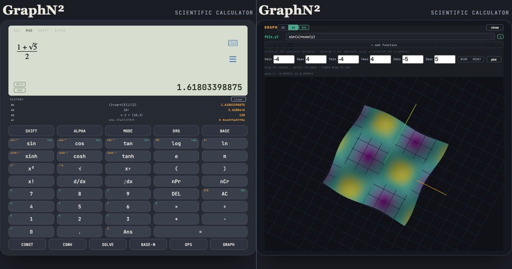
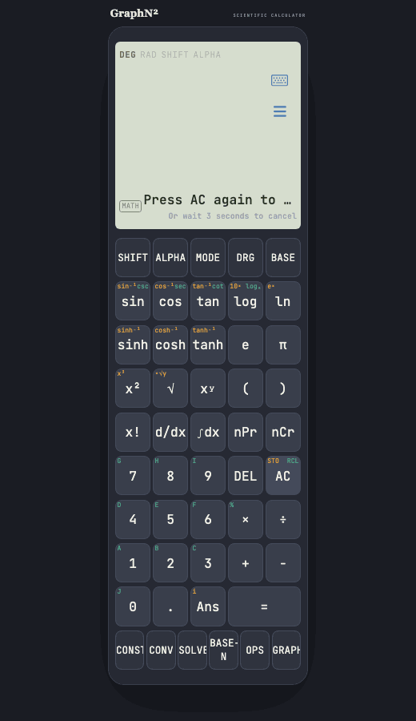
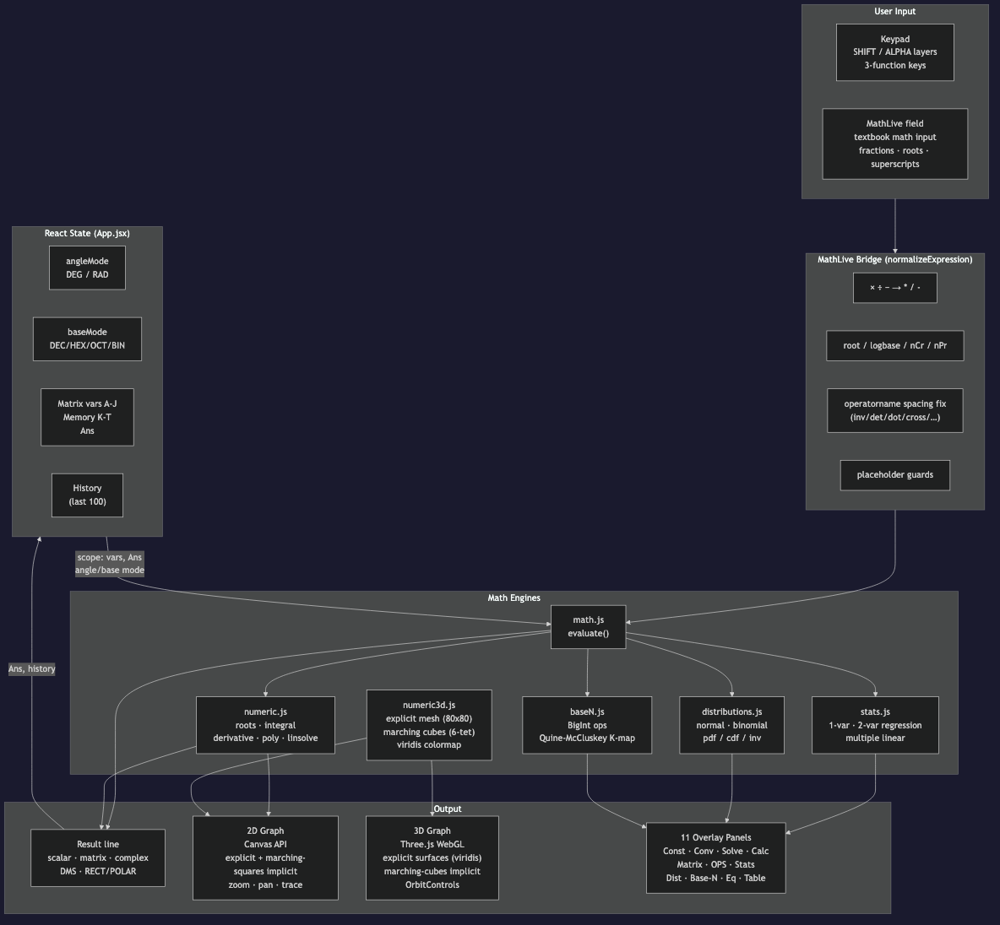
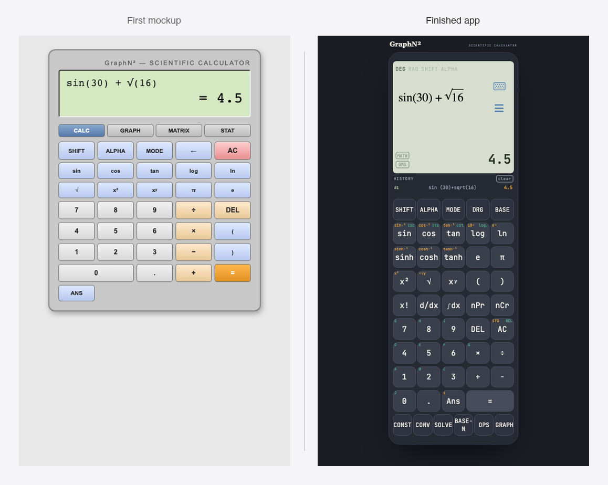

# I Rebuilt the Calculator That Got Me Through Engineering School (Part 1 of 3)

*A Casio calculator, a browser tab, and architecture decisions that had to
work before I knew what I'd need them for.*

*This is Part 1 of a three-part series on building GraphN², a full-featured
graphing scientific calculator in the browser, working with Claude. Part 1
covers why it exists, what it actually does, and the architecture and
collaboration model underneath it. [Part 2 →](LINK) covers the honest
numbers on speed and cost, and the three hardest technical problems. [Part
3 →](LINK) covers testing, shipping, and why this matters to me personally.
Prefer to read the whole thing in one sitting? [The full version is on
GitHub](LINK).*

**Sum It Up** — GraphN² is a full-featured graphing scientific calculator in
the browser, and this article is less about the feature list and more
about what it takes to own a system like this end to end. An expression
parser and evaluator serve nine different modes off one shared engine,
built before I knew what all nine modes would even be. None of it is
capped at what a physical calculator's memory or display would allow:
equation and polynomial degree, matrix and vector dimensions, regression
predictors, eight-variable Karnaugh maps, simultaneous graphs, all sized
for software instead of a fixed ROM chip. A from-scratch marching cubes
implementation renders 3D implicit surfaces in WebGL. It shipped with the
production discipline most side projects skip: 700-plus tests, real bugs
found and fixed after launch with the actual PR history to prove it, and
three-axis observability covering usage, errors, and performance. Built in
three days, six to ten hours each, working with Claude on implementation
while I owned architecture, scope, and every trade-off. Live at
graph.nsquaredcreative.ca, code is public, try it before reading the rest
if you'd rather see it than read about it.

---

## 1. Why I Built This

Every exam I wrote in engineering school, one object sat next to my pencil:
a Casio fx-991ES. Every problem set, every late night before a deadline, it
was there. I knew it well enough to use shortcuts most people never
touched: SOLVE for equations I didn't want to rearrange by hand, the stats
mode for regression without opening a spreadsheet, base-N conversion for
the one digital logic course that needed it.

Later, in my bachelor's, the tools got bigger. Graphmatica for quick 2D
plots. Wolfram when I needed to see a function's shape before I trusted my
own derivative. MATLAB carried the heavy lifting, Fourier transforms, full
circuit simulations, anything that genuinely needed real code, and it did
that better than anything else I've used since. But for a five-second
sanity check on a simple equation, opening a laptop and writing a script
was more than the moment called for. I wanted that same depth available
without needing to sit down for it.

Years later, I wanted that whole toolkit back, not as nostalgia, but as
something I could actually use and eventually hand to my own kid. Something
that turns "what does this function look like" into an answer in seconds,
because that kind of fast feedback loop is what builds spatial intuition in
the first place. So I built GraphN². What I didn't expect was how much of
actual engineering that turned out to involve.

If you had a tool like this in school, or you're a developer who's ever
thought "I could build something I actually needed instead of another to-do
app," this is what that looks like end to end: the reasoning behind it, the
architecture, and the specific problems that made it hard. If nothing else,
I'd like this to be a nudge to go build the tool you wished existed when you
were learning. It's a better portfolio project than most, because nobody can
fake having actually used the thing they're rebuilding.

---

## 2. What GraphN² Actually Is

Picture the outpost you find at a trailhead halfway up a mountain pass, the
kind with one small room that somehow stocks a spare bike tube, a folding
tripod, a kayak patch kit, and a phone charger. Nobody stops there because
any single item is the best in its category. They stop because they
didn't realize they needed four different specialty shops until this one
place, at exactly the right bend in the road, saved them the trip back
down. That's the shape I wanted for GraphN², the one tab you open when you
don't want to remember which of five tools has the feature you need today.
It won't replace MATLAB for research-grade work. But it's not a toy
either, it's a real expression parser, real numeric methods, and real
WebGL rendering, unified into one place instead of scattered across five
tools.

So, concretely, what's actually in the store:

- **Calc mode**, textbook math input via MathLive, evaluated live, angle
  mode aware, with full complex number support
- **2D graphing**, explicit and implicit curves, with pan, zoom, and trace
- **3D graphing**, explicit surfaces and implicit surfaces via marching
  cubes, rendered in WebGL
- **Matrices and vectors**, determinant, inverse, transpose, dot and cross
  product
- **Statistics**, single and paired-variable stats, linear/quadratic/log/
  exponential/power regression
- **Distributions**, normal and binomial, pdf, cdf, and inverse
- **Equation mode**, poly-solv for closed-form roots, sys-solv for linear
  systems
- **Calculus**, numeric derivative and definite integral on any typed
  expression
- **Unit conversion**, sixteen categories, ninety-plus units
- **A scientific constants library**, CODATA-style, five categories
- **Base-N arithmetic**, binary through hex
- **Karnaugh map minimization**
- **Table mode**, for any expression, not just stored graph functions

It's live at graph.nsquaredcreative.ca, and installable as a PWA, so it
behaves like an app on your phone or desktop instead of just another
browser tab you'll lose track of.

Worth calling out directly: three of the items on that list, the 3D
graphing, the Karnaugh map minimization, and the PWA installability, didn't
start as core scope. They were stretch goals from the very first planning
conversation, the kind of idea you throw out early and half expect to cut
later. All three shipped anyway, which says something about what's
actually possible to reach for once the boring foundational work is solid.

There's a quieter design decision running under most of that list too:
nothing in it is capped at what a physical calculator's memory or display
would actually allow. A real device has good reasons for those limits,
fixed ROM, a tiny screen, a battery. None of those reasons survive the
move into a browser, so most of them didn't get carried over on autopilot.

None of that is interesting as a feature list on its own, features never
are. What's actually interesting is what it takes to make "type an
equation, get an answer" work correctly across all of it at once, and
that's where the real story starts.

---

## 3. The Real Problem: A Calculator Isn't Arithmetic, It's an Interpreter

Type "1 + 2" into a text box and printing "3" back is arithmetic. It's also
not that interesting, and it's exactly where most "build your own
calculator" tutorials stop, because the string-to-number part really is
easy.

The moment you type `sin(30) + 2x - sqrt(3)` instead, you've stopped doing
arithmetic and started writing a program, and something has to run it.
That string isn't an answer waiting to be read off, it's source code.
Something has to tokenize it into pieces the machine can reason about,
build a tree out of those pieces so operator precedence and nesting are
unambiguous, decide what `sin` means given whatever angle mode happens to
be active right now, substitute in whatever `x` currently equals, walk the
tree to actually compute a value, and then render that value back as
proper math notation instead of a plain decimal. None of that is unusual
for a compiler or an interpreter to handle. It is unusual for a
"calculator," and that gap is exactly where the real engineering starts.

That's one expression, in one mode. GraphN² has to run that same
interpreter underneath nine different modes, graphing, matrices,
statistics, equation solving, without turning into nine different copies
of the same parsing and evaluation logic. And the parser and evaluator had
to be built before I actually knew what all nine of those modes would
even be, which changes the design question from "make this expression
evaluate correctly" to "make this evaluate correctly for consumers that
don't exist yet."

---

## 4. Architecture: Five Layers, One Direction

The answer is to never let a mode touch the parser or the evaluator
directly. Every mode is a consumer of one shared engine, not an owner of
its own copy of one. At the point this got decided, graphing was the only
other mode actually planned, statistics, equation solving, matrices, and
the rest showed up later as stretch goals turned real. The layering had to
hold up for modes that didn't exist yet when it was drawn, which is a
different bar than making it work for the one mode in front of you.

- **Input (MathLive)** captures what you type as editable math notation
- **Bridge** translates MathLive's LaTeX into something the engine can
  parse
- **Engine (math.js + custom numeric)** does the actual interpreting:
  parsing, evaluation, and the hand-written numeric methods math.js doesn't
  cover
- **State (React)** holds the current mode, variables, angle mode, and
  whatever the engine last returned
- **Output (Screen/Graph)** renders that state back out, as a result line,
  a plotted curve, a 3D surface, whatever the active mode needs

The bridge layer exists for a boring but necessary reason: MathLive speaks
LaTeX, math.js speaks its own expression grammar, and something has to sit
between them translating one into the other before evaluation can happen
at all. It's the least glamorous piece of the whole system, and also the
first one to break.

Neither of those two libraries was a default, either. Writing a parser and
evaluator from scratch was genuinely on the table, and it's the one place
in this whole project where getting it wrong is silent and expensive:
operator precedence, implicit multiplication, complex-number edge cases,
all bugs that produce a plausible wrong answer instead of a crash. math.js
already handles that correctly for a huge surface area, parsing,
complex numbers, matrices, units, so writing a custom one would have meant
re-discovering those edge cases the hard way instead of inheriting a
library that already had. Same reasoning on the input side: KaTeX renders
math beautifully but doesn't help with an actively-being-edited expression,
where the cursor is inside a fraction matters. MathLive is built
specifically for that problem. Both choices cost something, math.js's
conventions don't always match what a Casio would do out of the box, and
MathLive is a heavier dependency than hand-rolled HTML, but both were
picked for what they solved, not because they were the first result in a
search.

---

## 5. How This Actually Got Built

I built this with Claude, and I want to be specific about what that means,
because "I used AI to build an app" covers everything from typing one prompt
and shipping whatever came out, to something much closer to running a small
project.

This was the second kind. It started as a conversation, not a code
generator: we listed out every feature I remembered from the fx-991ES and
the tools I'd used after it, then argued about scope before writing a
single line. We mocked up the keypad and screen as static HTML first,
clicked through it like a real device, and only moved to actual code once
the interaction model was right. When Claude proposed an architecture, I
asked it to explain the tradeoffs between options I didn't know well enough
to have an opinion on yet, math.js versus a hand-rolled parser, MathLive
versus KaTeX, so the decisions were mine, made with better information, not
just accepted.

Once the scaffold existed, the real work was the part no AI can do for you:
running it in an actual browser, typing real expressions, and finding the
gap between "the code looks right" and "the code is right." A cursor that
jumped to the end of the line after every keystroke. A delete key that
erased the wrong character. Those bugs only exist once a human is actually
using the thing, and finding them, describing them precisely, and deciding
what "fixed" should feel like was my job, not the model's.

The honest way to describe the split: Claude was fast at generating correct
code once the problem was well specified, and genuinely useful as a
sounding board for architecture decisions. I was the one deciding what to
build, in what order, what "good enough" meant at each stage, and whether
what came back actually solved the problem I'd described. That's closer to
directing a very fast junior engineer than it is to delegating the whole
project, and it's a workflow I'd recommend to anyone building something
real, not just a demo.

It also matched my own gaps honestly. My strength has always been the
backend, and the harder skill I actually bring is turning a simple idea
into a real product shape, deciding what it should do, what order to build
it in, what's actually worth building at all. Frontend has never been where
I'm strongest, and this project needed a lot of it: a textbook math editor,
a keypad with three layers of meaning per key, a graph renderer, a 3D
viewport. Claude handled that side without it ever becoming the bottleneck
it would have been if I'd had to learn it from scratch mid-project.

None of this started from familiar ground, either. I didn't know how a
calculator's evaluation engine should be structured when I started, and I
didn't know how MathLive, canvas rendering, or WebGL actually worked under
the hood. That's not a gap unique to this project, it's closer to the
default state for a backend and distributed systems engineer picking up a
genuinely new domain. Most of what that job actually trains you for is
walking into a system you don't yet understand and figuring out its real
shape before touching a line of code. That instinct is what let me direct
the frontend pieces confidently without being the one implementing them by
hand. Understanding a system well enough to ask the right questions and
judge the answers is a different skill from writing every layer of it
yourself, and it's the one I actually bring.

---

---

*That's Part 1. [Continue to Part 2 →](LINK), where the honest numbers on
speed and cost show up, along with the three hardest technical problems in
the whole build: a cursor that wouldn't stay put, a root-finder that
needed a fallback chain, and a 3D surface that isn't a function. Or [read
the whole thing on GitHub](LINK) if you'd rather not wait.*
