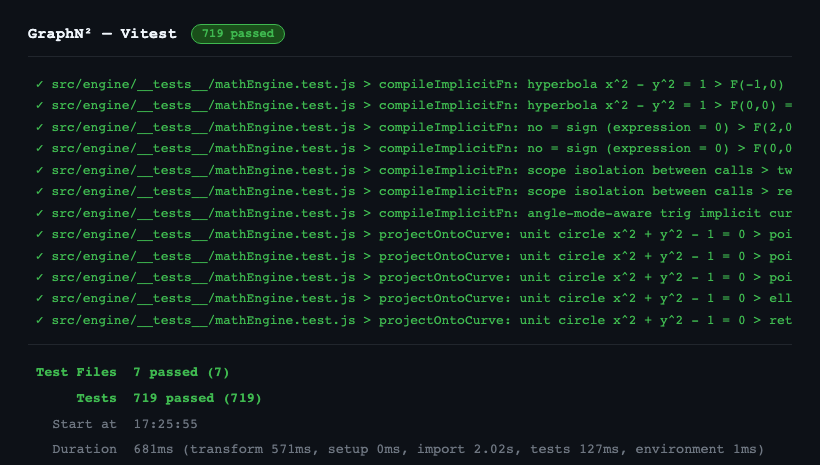
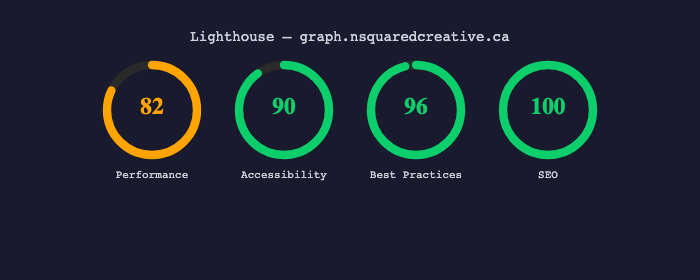
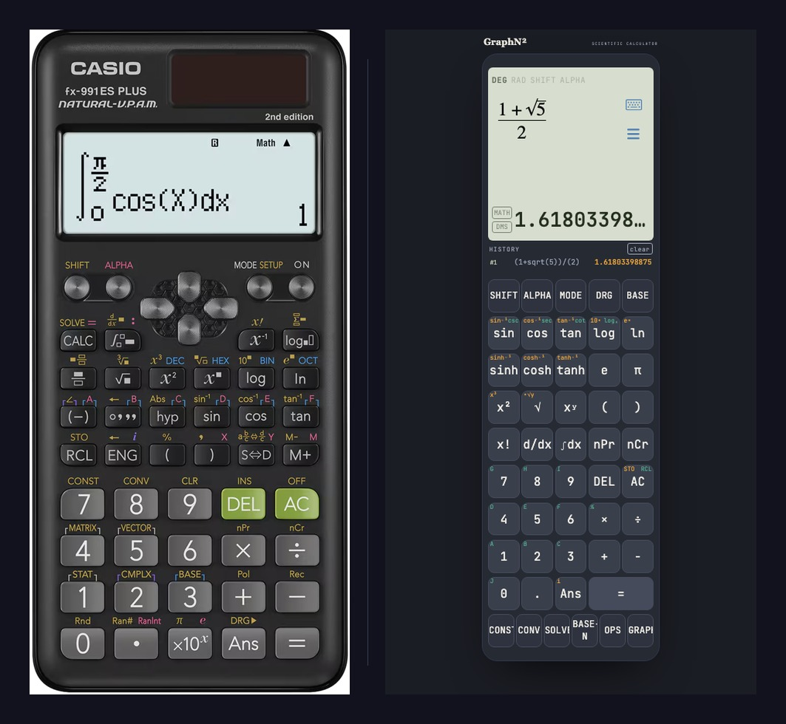

# I Rebuilt the Calculator That Got Me Through Engineering School (Part 3 of 3)

*Why a calculator's bugs are the silent kind, what shipping it like a real
product actually took, and why I built this in the first place.*

*This is Part 3, the finale, of a three-part series on building GraphN², a
full-featured graphing scientific calculator in the browser, working with
Claude. Part 1 covered why it exists and how it's architected. Part 2
covered the honest numbers on speed and cost, and the three hardest
technical problems in the build. This part covers testing, shipping it like
a real product, and why it matters to me.*

---

## 9. Testing a Calculator Is Different From Testing Most Apps

Most software fails loudly. A null reference crashes the request. A failed
API call throws an error the interface has to show you. The bug category
that actually matters in a calculator is the one that fails silently: type
in an expression, get back a number, and nothing about the screen tells you
whether to trust it. There's no stack trace for "this answer is wrong."

That's not actually a calculator-specific problem, it's the same failure
mode I spend most of my day job worrying about in distributed systems: a
service that returns a 200 with a subtly wrong payload is far more
dangerous than one that returns a 500, because nothing downstream knows to
distrust it. A wrong number on a calculator screen and a wrong value
silently propagating through a pipeline are the same bug wearing different
clothes.

That's the real argument for having 700-plus tests, not because a big
number looks good on a portfolio, but because it's the only real defense
against a bug that produces a plausible wrong answer instead of a visible
failure. A few examples of the kind of edge case worth its own test, not
because they're exotic, but because they're exactly the kind of thing that
looks fine until it doesn't:

- **Division by zero**, and not just once. Real-number division by zero,
  complex-number division by zero, and division by zero inside a graphed
  function all need to behave predictably, and "predictably" isn't the
  same answer in all three cases.
- **Angle mode boundaries**. `sin(180)` in degree mode should read as 0,
  but floating-point trigonometry doesn't naturally land on exactly 0, it
  lands on something like `1.2e-16`. Whether that gets displayed as `0` or
  as a very small, very wrong-looking non-zero number is a real design
  decision, not a rounding accident to shrug off.
- **Complex branch cuts and root-finding stability**. The square root of
  -1 is unambiguous, it's `i`. The cube root of a negative real number
  isn't, there are three valid complex roots, and deciding what "the"
  answer even means is a convention that has to be chosen deliberately.

That last category is where I'd rather show a real example than claim a
clean theory, because the theory didn't hold up on its own. The original
polynomial solver used a companion-matrix eigenvalue method for degree
three and higher, and it quietly failed to converge on any polynomial
where every root shares the same magnitude, `x³ - 5 = 0` being the exact
case that exposed it, since all three cube roots of 5 sit at the same
distance from the origin. Around the same time, taking an nth root of a
complex number didn't fall back to a wrong answer, it just refused to
compute one at all. Neither of those showed up in the original test suite.
Both showed up because I kept using the calculator after it shipped,
noticed the failure, and fixed it properly: a different root-finding
algorithm for the first, a principal-value fallback for the second, and
new tests written specifically against the failing cases so they can't
silently regress.

I want to be honest about what that means rather than round it up into a
tidier story. I tested this as thoroughly as the time I'd actually
allocated to the project allowed, not exhaustively, and I don't think
exhaustively was ever the realistic bar. Shipping with the coverage a
reasonable time budget can buy, and then treating whatever surfaces after
that as a normal follow-up fix rather than a crisis, is how most real
software actually gets built. The test count is a defense against silent
wrong answers, not a claim that every edge case is already found.

None of this is the kind of bug a person would notice from casual use.
It's exactly the kind a test suite, and continued use after shipping,
exists to catch before a student, or my own kid a few years from now, hits
one mid-homework with no way of knowing the calculator, not the math, is
what's wrong.

Tests passing locally is also its own kind of false confidence. None of it
means anything if what actually ships to a browser is a different build
than the one that was tested.

---

## 10. Shipping It Like a Real Product

A calculator that only runs on localhost isn't a product, it's a demo, and
the gap between those two things is most of what actually separates a side
project from production engineering.

- **Deployment**: this didn't start where it ended up. The first target
  was GitHub Pages, the simplest possible option and a perfectly
  reasonable one for a prototype nobody outside the project had seen yet.
  Once it was clearly becoming something worth putting a real name on, I
  moved it to Cloudflare Pages specifically so it could live on an actual
  domain, graph.nsquaredcreative.ca, instead of a subdomain that announces
  which free tier it's running on. The auto-deploy-on-push workflow didn't
  change, what changed was deciding the project had outgrown looking like
  a prototype.
- **PWA installability**: a Workbox-driven service worker and manifest
  mean the calculator can be installed like any other app, on a phone home
  screen or a desktop dock, and it keeps working offline once the assets
  are cached. That's the difference between "a tab you'll probably lose"
  and something that behaves like it belongs on the device.
- **Defensive UX for destructive actions**: AC on an already-empty field,
  or MODE → RESET ALL, doesn't wipe everything on one tap. It shows a
  confirmation, labeled in red to signal danger, with a few seconds to
  back out before it commits to erasing memory slots, history, and every
  mode setting at once.

That last one is less a feature decision than a habit showing up in the
code. I think about defensive strategies and exit ramps by default, in
work and outside it, plan the forward path, but also plan what backing out
looks like before you need it. A calculator is about as low-stakes as
software gets, and it still got a two-step confirmation and a cancel
window for its one truly destructive action, because "never let a single
accidental tap erase something you can't get back" isn't really a UX
rule. It's closer to how I try to plan anything with an irreversible step
in it, blast radius first, exit plan second, then build the feature.

That's the same instinct behind the observability setup that follows, not
coincidentally. Knowing what breaks and being able to undo it are two
sides of the same discipline: assume something will eventually go wrong,
and make sure there's a way to see it and a way back from it, before you
need either one.

- **Observability, on three separate axes**. GA4 custom events answer a
  product question: which modes actually get used, whether 3D graphing
  gets opened at all, or whether it's a feature that looks good in a demo
  and nowhere else. Sentry answers a different question: what's breaking
  in production that nothing caught beforehand. Web Vitals, reported
  through GA4, answers a third: is it actually fast to use. That last one
  matters more here than it would in most apps, marching cubes and WebGL
  rendering can genuinely block the main thread if a surface is complex
  enough, and INP is exactly the metric that would catch a frame where the
  3D view stops responding for a moment. Three separate questions, three
  separate signals, not one vague "add analytics" checkbox: a crash
  dashboard tells you the app is broken, a usage dashboard tells you
  whether you built the right thing, and a performance metric tells you
  whether it's pleasant to actually use.

That distinction matters because of what it enables: traceability, not
just monitoring. Sentry is the same category of tool that would have
surfaced the nthRoot bug from the last section the moment a real person
hit it, not whenever I happened to stumble back onto it myself. From
there, the actual chain is a normal one: an error gets caught, it becomes
a pull request with a clear problem statement, a fix, and a test that
locks the failure case down so it can't quietly come back. That loop,
symptom to diagnosis to fix to regression test, is the entire point of
observability. A dashboard nobody acts on isn't observability, it's decor.

None of this is interesting code. It doesn't show up in a demo video, and
nobody's going to screenshot a Workbox config. But it's the actual
difference between a project that works when you show it to someone once
and one that's still working when they open it again next week without you
in the room. That's the same instinct backend and distributed systems work
trains into you by default: it isn't done at "the code runs," it's done at
"deployed, monitored, and somebody other than me finds out the moment it
breaks."

Shipped isn't the same as finished, though, and what's left isn't really
about infrastructure anymore.

---

## 11. What's Next, and Why This Matters to Me

Spatial thinking is the thing I keep coming back to. Watching a curve
actually bend as you change a coefficient, watching a 3D surface twist as
you rotate it, is a different kind of understanding than reading the
correct answer off a screen. The fx-991ES gave me exact answers, fast, and
that mattered plenty, a seven-segment display was always going to be about
numbers, not shapes, and it did numbers about as well as a calculator can.
Graphmatica and MATLAB filled in the shape part, but only once I was
already sitting at a computer with the intent to open them. What I
actually wanted was that same "let me just see it" instinct available in
the same five seconds it takes to check an arithmetic mistake, no context
switch, no separate tool to remember exists.

That's still the plan for what's next: table mode getting the same
trace-and-compare treatment the graphs already have, a proper equation
history you can scroll back through, maybe eventually parametric and
polar plotting alongside the explicit and implicit surfaces that already
work. None of it is urgent. The part that mattered most, having the whole
toolkit live in one place, already shipped.

The name isn't really about math notation. If you know the people behind
it, you already know why it fits. If you don't, that's fine too, some
things are just for the people they're for.

A few years from now, I want to open this on a shared screen with my kid
and watch a graph move because they nudged a number, the same small
"oh, that's what that means" moment I used to get from a calculator with
a Casio logo on it. That's the actual reason this exists. Everything else
in this article, the architecture, the algorithms, the tests, the
deployment pipeline, was in service of that one moment being worth having.

GraphN² is live at graph.nsquaredcreative.ca, and the code is on GitHub if
you want to see how any of this is actually built, the architecture, the
numeric methods, the tests, all of it, in case any of it saves someone
else the same weeks I didn't have to spend. If you build something like
this yourself, or you already have, I'd genuinely like to hear about it.

---

*That's the series. Thanks for reading, and if you build something like this
yourself, I'd genuinely like to hear about it.*
